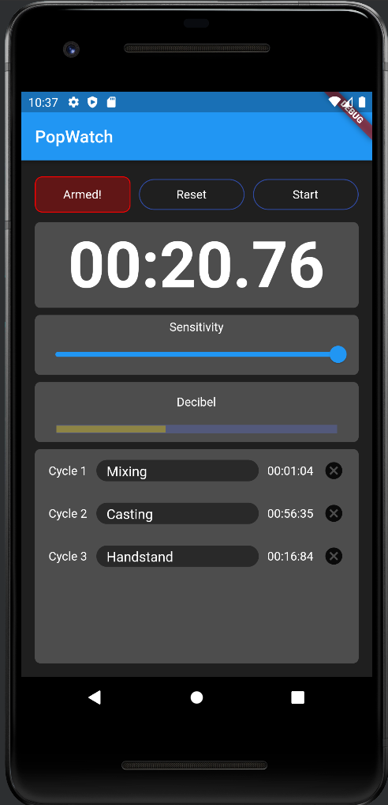

# Popwatch App

## Overview and Usage

This is a basic app that solves an assortment of niche issues. The app can start a stopwatch without the involvement of hands or the delay and voice recognition issues of common used solutions. The stopwatch starts simply on a high decibel value from the microphone input stream. The same way that it is stopped. A reset button can reset the timer and logs the current elapsed time. Any cycle can be named or entirely removed from the logs. A manual override start and stop button was added as well.

## Application

Applications are of course endless. I aim to use this app for time critical processes, like mixing, casting and curing resins, cooking, heat treating and more. This also helpts to make these processes repeatable for future reference. Another application I was interested in is timing static calisthenic exercises, such as the handstand, to track progress.

## Source Material

Since this is my first flutter project, I used a few resources to develop the app. Those are listed below:

- Very slow introduction to flutter from this video by [Academind](https://www.youtube.com/watch?v=x0uinJvhNxI&t). I used it mostly for syntax introduction and styling showcase. 
- I used an adapted implementation of the stopwatch by [code doctor](https://www.youtube.com/watch?v=iI-BR-fr0bQ).
- For the audio streaming I used the package noise_meter by [cachet.dk](https://pub.dev/packages/noise_meter). The example code is pretty much everything you need. 
- For the animation of the noise meter I adapted the gauge example in an ITNEXT article by [Kenneth Reilly](https://itnext.io/build-an-animated-gauge-in-flutter-e495a436dbf8). Careful though, the code is deprecated, since it was released before flutter introduced null-safety. Easily adaptable though.
